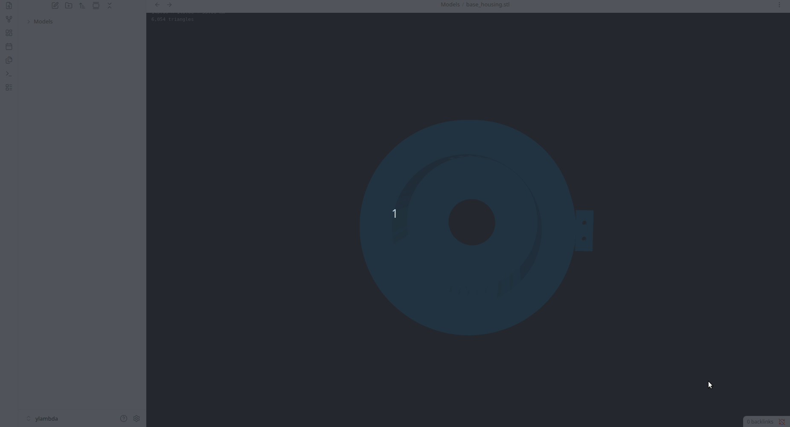
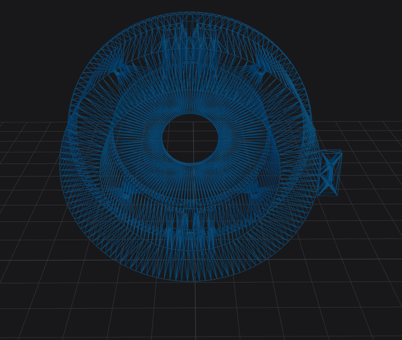

# Overview
The intention of this plugin is to view the STL files while using the Obsidian notes. Existing model viewer plugins require conversion to GLB format for rendering.
While STL is a mesh format (not parametric CAD), this plugin focuses on documentation and visual inspection, not editing.

# STL Preview — Obsidian Plugin

Render `.stl` 3D model files directly inside Obsidian using an interactive Three.js viewer.
Also ships a **standalone browser viewer** deployable to GitHub Pages — no Obsidian required.




One can also preview wireframe of the STL file.


---

## Features

- **Native file integration** — `.stl` files open automatically in the 3D viewer tab; no extra steps
- **Interactive orbit controls** — rotate, pan, and zoom with mouse or trackpad
- **Toolbar actions** — Reset camera · Toggle floor grid · Toggle wireframe
- **Settings panel** — choose background colour, model colour, and grid visibility; changes apply live without reloading
- **File info overlay** — filename, bounding-box dimensions (mm), and triangle count displayed in-viewer
- **Standalone web viewer** — `stl-viewer.html` works in any browser: drag-and-drop local files or load via `?src=<url>`
- **Desktop only** — uses WebGL renderer, declared `isDesktopOnly` in manifest

---

## Installation

### From a GitHub release (manual)

1. Download `main.js`, `manifest.json`, and `styles.css` from the [latest release](../../releases/latest).
2. Create the folder `<your-vault>/.obsidian/plugins/obsidian-stl-preview/`.
3. Copy the three files into that folder.
4. Open Obsidian → **Settings → Community plugins** → enable **STL Preview**.

### BRAT (beta / pre-release)

1. Install the [BRAT](https://github.com/TfTHacker/obsidian42-brat) community plugin.
2. In BRAT settings, add `ramakrishnaravi/obsidian-stl-preview`.

---

## Usage

### Obsidian plugin

Open any `.stl` file from the file explorer — it opens in a 3D viewer tab automatically.

| Action | How |
|---|---|
| Rotate | Left-click drag |
| Pan | Right-click drag (or Shift + left-click drag) |
| Zoom | Scroll wheel |
| Reset camera | Toolbar `home` button |
| Toggle grid | Toolbar `grid` button |
| Toggle wireframe | Toolbar `eye` button |
| Change colours / grid | Settings → STL Preview |

Settings are applied live to all open STL tabs — no reload needed.

### Standalone web viewer

Open `stl-viewer.html` in any browser:

- **Drag and drop** a `.stl` file onto the viewer window
- **Click** the drop zone to browse for a file
- **URL parameter** — append `?src=<url>` to load a remotely-hosted STL:

  ```
  stl-viewer.html?src=https://example.com/models/part.stl
  ```

  The remote URL must be CORS-accessible. GitHub raw URLs work directly.

---

## GitHub Pages deployment

The standalone viewer can be hosted on GitHub Pages so you can share links to STL files.

### Enable once

1.  Go to **Settings → Pages → Source** → select **GitHub Actions**.

The `pages.yml` workflow runs automatically on every push to `main` and deploys the viewer to:

```
https://<owner>.github.io/obsidian-stl-preview/
```

### Shareable links

```
https://<owner>.github.io/obsidian-stl-preview/?src=https://raw.githubusercontent.com/<owner>/<repo>/main/models/part.stl
```

---

## Development

### Prerequisites

- Node.js ≥ 22
- npm

### Setup

```bash
git clone https://github.com/ramakrishnaravi/obsidian-stl-preview.git
cd obsidian-stl-preview
npm install
```

### Build

```bash
npm run build   # produces main.js and stl-viewer.html
npm run dev     # watch mode with inline sourcemaps
```

### Test in Obsidian

Symlink (or copy) the plugin folder into a test vault:

```bash
ln -s "$(pwd)" "/path/to/vault/.obsidian/plugins/obsidian-stl-preview"
```

Then enable the plugin in Obsidian settings. Use **Ctrl/Cmd+R** (reload app without saving) after each rebuild.

### Bump version

```bash
node scripts/version.mjs 1.2.3
```

Updates `manifest.json`, `package.json`, and `versions.json` in one step. Then tag and push to trigger the release workflow:

```bash
git add manifest.json package.json versions.json
git commit -m "chore: bump to 1.2.3"
git tag 1.2.3
git push && git push --tags
```

---

## Project structure

```
obsidian-stl-preview/
├── .github/
│   └── workflows/
│       ├── pages.yml          # Deploy standalone viewer to GitHub Pages
│       └── release.yml        # Publish main.js + manifest + styles on git tag
├── scripts/
│   └── version.mjs            # Version bumping script
├── src/
│   ├── main.ts                # Plugin entry point, settings, settings tab
│   ├── stl-view.ts            # FileView subclass — Three.js renderer
│   ├── viewer.ts              # Standalone viewer logic (compiled into stl-viewer.html)
│   └── viewer.html            # HTML template for standalone viewer
├── esbuild.config.mjs         # Build script (plugin CJS + standalone IIFE)
├── manifest.json              # Obsidian plugin manifest
├── package.json
├── styles.css                 # Plugin CSS (overlay, loading spinner)
├── tsconfig.json
└── versions.json              # Plugin version → min Obsidian version map
```

---

## Technical stack

| Usecase | Library |
|---|---|
| 3D rendering | [Three.js](https://threejs.org) v0.172 |
| STL parsing | `three/examples/jsm/loaders/STLLoader` |
| Orbit camera | `three/examples/jsm/controls/OrbitControls` |
| Build | [esbuild](https://esbuild.github.io) |
| Plugin API | [Obsidian API](https://github.com/obsidianmd/obsidian-api) ≥ 1.4.0 |

---

## Non-goals

- Editing or modifying STL geometry
- Parametric CAD operations
- Mobile support

---

## Performance notes

- Very large STL files (>5–10M triangles) may be slow depending on GPU
- Binary STL loads significantly faster than ASCII STL

---

## Note
``` Parts of this project were co-authored with the assistance of an AI model. ```

---

## License

MIT
